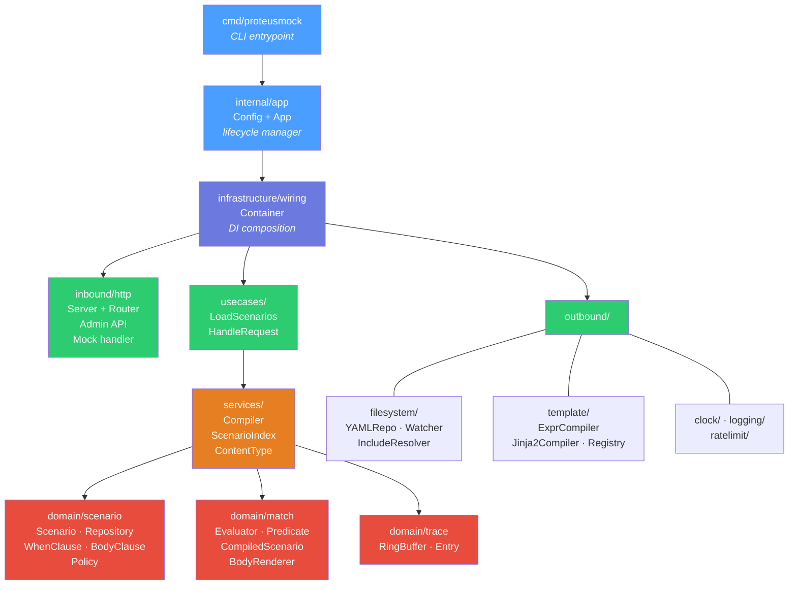
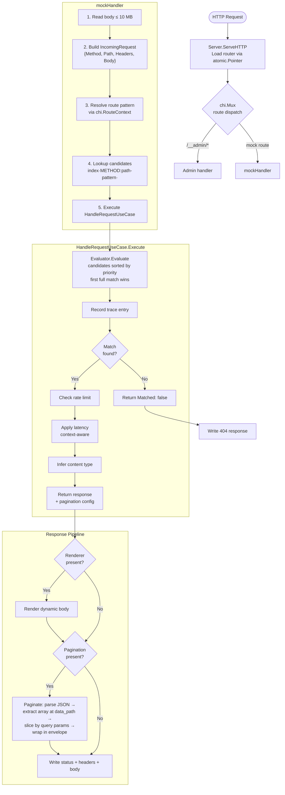
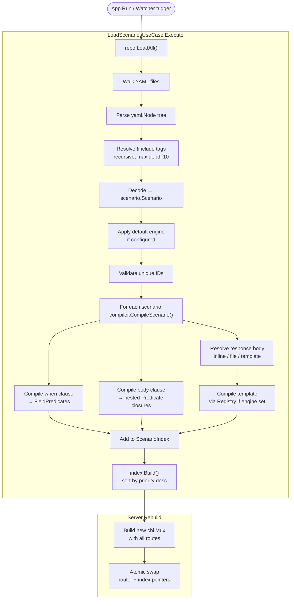

# Architecture

## Overview

ProteusMock is an HTTP mock server that matches incoming requests against YAML-defined scenarios and returns configured responses. It follows **Domain-Driven Design** with a **Hexagonal (Ports & Adapters)** architecture. The domain layer has zero external dependencies; all I/O crosses port interfaces defined in the infrastructure layer.

Key responsibilities:
- Load and compile YAML scenarios into an in-memory index
- Match HTTP requests against compiled predicates (method, path, headers, body)
- Render static or dynamic (templated) response bodies
- Enforce per-scenario rate limits and latency policies
- Hot-reload scenarios on file changes with zero downtime

## Component Diagram

## Package Map

| Package | Role | Key Types | Notes |
|---|---|---|---|
| `cmd/proteusmock` | CLI entrypoint | `main()` | Parses flags, creates `App`, calls `Run` |
| `internal/app` | Lifecycle | `Config`, `App` | Owns startup, shutdown, watcher setup |
| `internal/domain/scenario` | Domain entities | `Scenario`, `Repository`, `WhenClause`, `BodyClause`, `Policy` | Zero deps |
| `internal/domain/match` | Matching engine | `Evaluator`, `Predicate`, `CompiledScenario`, `BodyRenderer`, `RenderContext` | Zero deps |
| `internal/domain/trace` | Request tracing | `RingBuffer`, `Entry`, `CandidateResult` | Thread-safe ring buffer |
| `internal/infrastructure/ports` | Port interfaces | `Clock`, `Logger`, `RateLimiter` | Contracts for adapters |
| `internal/infrastructure/services` | Compilation & indexing | `Compiler`, `ScenarioIndex`, `Paginate`, `InferContentType` | Compiles YAML into predicates, paginates responses |
| `internal/infrastructure/usecases` | Application logic | `LoadScenariosUseCase`, `HandleRequestUseCase` | Orchestrates domain + infra |
| `internal/infrastructure/inbound/http` | HTTP adapter | `Server` | chi router, admin & mock handlers |
| `internal/infrastructure/outbound/filesystem` | YAML adapter | `YAMLRepository`, `Watcher`, `IncludeResolver` | Implements `scenario.Repository` |
| `internal/infrastructure/outbound/template` | Template engines | `Registry`, `ExprCompiler`, `Jinja2Compiler` | Implements `match.BodyRenderer` |
| `internal/infrastructure/outbound/clock` | Clock adapter | `RealClock` | Implements `ports.Clock` |
| `internal/infrastructure/outbound/logging` | Log adapter | `SlogLogger` | Wraps `slog.Logger` |
| `internal/infrastructure/outbound/ratelimit` | Rate-limit adapter | `TokenBucketStore` | Per-key token bucket with TTL eviction |
| `internal/infrastructure/wiring` | DI container | `Container`, `Params` | Constructs and wires all components |
| `internal/testutil` | Test fakes | `NoopLogger`, `FixedClock`, `StubRateLimiter`, `StubBodyRenderer` | Shared across test packages |

## Request Flow

## Scenario Load Flow

## Key Abstractions (Ports & Adapters)

| Port (Interface) | Location | Adapter | Location |
|---|---|---|---|
| `scenario.Repository` | `domain/scenario/` | `YAMLRepository` | `outbound/filesystem/` |
| `match.BodyRenderer` | `domain/match/` | `exprRenderer`, `jinja2Renderer` | `outbound/template/` |
| `ports.Clock` | `infrastructure/ports/` | `RealClock` | `outbound/clock/` |
| `ports.Logger` | `infrastructure/ports/` | `SlogLogger` | `outbound/logging/` |
| `ports.RateLimiter` | `infrastructure/ports/` | `TokenBucketStore` | `outbound/ratelimit/` |
| `services.TemplateRegistry` | `infrastructure/services/` | `Registry` | `outbound/template/` |

## Hot Reload

1. `fsnotify.Watcher` monitors root directory tree
2. Events debounced (default 500ms) to avoid rapid recompilation
3. Reload callback: `LoadScenariosUseCase.Execute()` -> `Server.Rebuild()`
4. `atomic.Pointer[chi.Mux]` and `atomic.Pointer[ScenarioIndex]` ensure zero-downtime swap
5. New directories are auto-watched

## Concurrency Model

- **Main goroutine**: HTTP server via `http.Server.ListenAndServe`
- **Watcher goroutine**: file-change listener + debounce timer
- **Rate-limiter eviction goroutine**: periodic cleanup of stale entries
- **Atomic pointers**: router and index swapped atomically (no mutex)
- **RingBuffer**: mutex-protected for concurrent trace writes/reads

## Security

- **Path traversal prevention**: `!include` and `body_file` paths validated via `filepath.EvalSymlinks` + root prefix check
- **Include depth limit**: max 10 levels of nesting
- **Body size limit**: 10 MB max request body
- **No authentication** on mock or admin endpoints (by design -- intended for local/test use)

## Observability

| Signal | Implementation | Access |
|---|---|---|
| Structured logging | `slog.Logger` via `ports.Logger` | stderr (configurable level) |
| Request tracing | `trace.RingBuffer` (fixed size, default 200) | `GET /__admin/trace?last=N` |
| Scenario inspection | Admin API | `GET /__admin/scenarios` |
| Scenario search | Admin API | `GET /__admin/scenarios/search?q=term` |
