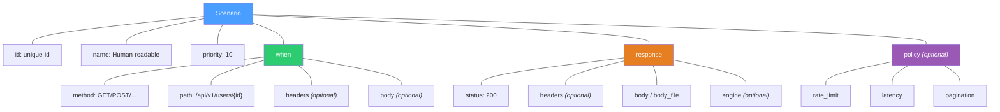
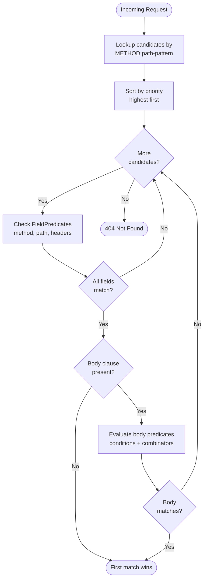
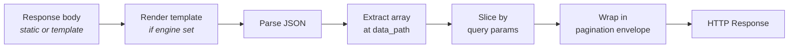

# Configuration Guide

A progressive tutorial for writing ProteusMock scenarios. Start with a minimal health-check and build up to advanced features like body matching, template engines, and pagination.

> **Looking for reference tables?** See [USAGE.md](USAGE.md) for CLI flags, admin API, full YAML reference, and error codes.

## Before You Start

**Prerequisites:**

- ProteusMock binary built (`make build`) or running via Docker
- A root directory for scenario files (default: `./mock`)

**Hot reload:** ProteusMock watches your root directory for changes. Save a YAML file and the server picks it up automatically -- no restart needed.

**Start the server:**

```bash
bin/proteusmock --root ./mock --port 8080
```

All scenario YAML files are loaded recursively from `--root`. You can organize them in subdirectories however you like.

---

## Your First Scenario

Create `mock/scenarios/health.yaml`:

```yaml
id: health-check
name: Health Check
priority: 100
when:
  method: GET
  path: /api/v1/health
response:
  status: 200
  headers:
    Content-Type: application/json
  body: '{"status": "ok"}'
```

Test it:

```bash
curl http://localhost:8080/api/v1/health
# {"status": "ok"}
```

Every scenario needs four things: `id`, `name`, `when` (matching rules), and `response` (what to return). The `priority` field controls evaluation order when multiple scenarios match the same path.

---

## Scenario Structure Overview



| Field | Required | Description |
|-------|----------|-------------|
| `id` | Yes | Unique identifier across all loaded scenarios |
| `name` | Yes | Human-readable label (shown in admin API) |
| `priority` | No | Higher values are evaluated first (default: 0) |
| `when` | Yes | Request matching rules |
| `response` | Yes | Status, headers, and body to return |
| `policy` | No | Rate limiting, latency, and pagination |

---

## Request Matching

### Method and Path

The `method` field is case-insensitive in YAML but matched as uppercase internally. The `path` field uses chi-style patterns with `{param}` placeholders for path parameters.

```yaml
when:
  method: GET
  path: /api/v1/users/{id}
```

This matches `GET /api/v1/users/42`, `GET /api/v1/users/abc`, etc. The captured value is available to templates via `pathParam('id')`.

### Header Matching

Headers support two matching modes:

| Prefix | Mode | Example |
|--------|------|---------|
| `=` | Exact match | `=application/json` |
| *(none)* | Regex | `Bearer .*` |

```yaml
when:
  method: POST
  path: /api/v1/users
  headers:
    Content-Type: =application/json
    Authorization: "Bearer .*"
```

This matches requests with an exact `Content-Type` of `application/json` AND an `Authorization` header matching the regex `Bearer .*`.

### Body Matching

Body matching lets you inspect the request body using JSONPath (for JSON) or XPath (for XML). Specify `content_type` to tell ProteusMock how to parse the body.

#### Simple Conditions

```yaml
when:
  method: POST
  path: /api/v1/users
  body:
    content_type: json
    conditions:
      - extractor: "$.name"
        matcher: "=Alice"
```

This matches when the JSON body has a `name` field equal to `"Alice"`. Multiple conditions are implicitly ANDed -- all must match.

#### Multiple Conditions (Implicit AND)

```yaml
body:
  content_type: json
  conditions:
    - extractor: "$.name"
      matcher: "=Alice"
    - extractor: "$.age"
      matcher: "^\\d{2,}"       # regex: 2+ digit number
```

Both conditions must match for the scenario to activate.

#### Boolean Combinators

For complex logic, use `all` (AND), `any` (OR), and `not`:

**`any` -- matches if at least one child matches:**

```yaml
body:
  content_type: json
  any:
    - conditions:
        - extractor: "$.method"
          matcher: "=credit_card"
    - conditions:
        - extractor: "$.method"
          matcher: "=paypal"
```

**`all` -- matches if all children match:**

```yaml
body:
  content_type: json
  all:
    - conditions:
        - extractor: "$.status"
          matcher: "=confirmed"
    - conditions:
        - extractor: "$.total"
          matcher: "^\\d{3,}"
```

**`not` -- inverts the match:**

```yaml
body:
  content_type: json
  not:
    conditions:
      - extractor: "$.role"
        matcher: "=banned"
```

#### Nested Combinators

Combinators compose arbitrarily. Example: active AND (admin OR moderator) AND NOT suspended:

```yaml
body:
  content_type: json
  all:
    - conditions:
        - extractor: "$.status"
          matcher: "=active"
    - any:
        - conditions:
            - extractor: "$.role"
              matcher: "=admin"
        - conditions:
            - extractor: "$.role"
              matcher: "=moderator"
    - not:
        conditions:
          - extractor: "$.suspended"
            matcher: "=true"
```

#### XML Body Matching

Set `content_type: xml` and use XPath expressions:

```yaml
body:
  content_type: xml
  conditions:
    - extractor: "//order/status"
      matcher: "=pending"
```

### How Matching Works



---

## Response Configuration

### Status, Headers, and Inline Body

```yaml
response:
  status: 201
  headers:
    Content-Type: application/json
    X-Request-Id: abc-123
  body: '{"created": true}'
```

### External Body Files

Use `body_file` to load the response body from a file:

```yaml
response:
  status: 200
  body_file: responses/large-payload.json
```

The path is relative to the scenario YAML file's location.

### The `!include` Directive

`!include` lets you reuse YAML fragments and load external files:

```yaml
body: !include @root/responses/data.json      # relative to --root
body: !include @here/sibling.json             # relative to current file
body: !include ../shared/fragment.yaml        # relative to current file
```

**Rules:**

- `.yaml` / `.yml` files are parsed and recursively resolved (max depth 10)
- Other files (`.json`, `.xml`, `.txt`, etc.) are inserted as raw strings
- Path traversal outside the `--root` directory is rejected for security

---

## Template Engines

ProteusMock supports two template engines for dynamic responses. Set the `engine` field on the response to activate one.

| Engine | Syntax | Best for |
|--------|--------|----------|
| *(omitted)* | Static body, no interpolation | Fixed responses |
| `expr` | `${ expression }` | Simple value interpolation |
| `jinja2` | `{{ var }}` / `` | Conditionals, loops, complex logic |

### Expr Engine

Uses `${ }` delimiters for inline expressions:

```yaml
response:
  status: 200
  engine: expr
  body: |
    {
      "user_id": "${pathParam('id')}",
      "name": "${jsonPath('$.user.name')}",
      "uuid": "${uuid()}",
      "lucky": ${randomInt(1, 100)},
      "items": ${toJSON(seq(1, 5))}
    }
```

### Jinja2 Engine

Uses `{{ }}` for output and `` for control flow. Also exposes request data as template variables.

```yaml
response:
  status: 200
  engine: jinja2
  body: |
    {
      "source": "{{ queryParam('source') }}",
      
      "tier": "premium", "limit": 1000
      
      "tier": "free", "limit": 10
      
    }
```

**Jinja2 template variables:** `method`, `path`, `headers`, `queryParams`, `pathParams`, `body`, `now`.

### Shared Template Functions

Both engines share these functions:

| Function | Description | Example |
|----------|-------------|---------|
| `pathParam(name)` | Path parameter value | `pathParam('id')` → `"42"` |
| `queryParam(name)` | Query parameter value | `queryParam('page')` → `"1"` |
| `header(name)` | Header value (case-insensitive) | `header('X-Tier')` → `"premium"` |
| `body()` | Raw request body (Expr only) | `body()` → `"{\"name\":\"Alice\"}"` |
| `now()` | ISO-8601 timestamp | `now()` → `"2025-01-15T10:30:00Z"` |
| `nowFormat(layout)` | Go-formatted timestamp | `nowFormat('2006-01-02')` → `"2025-01-15"` |
| `uuid()` | Random UUID v4 | `uuid()` → `"a1b2c3d4-..."` |
| `randomInt(min, max)` | Random integer in [min, max] | `randomInt(1, 100)` → `42` |
| `seq(start, end)` | Integer sequence [start..end] | `seq(1, 3)` → `[1, 2, 3]` |
| `toJSON(value)` | Marshal value to JSON string | `toJSON(seq(1,3))` → `"[1,2,3]"` |
| `jsonPath(expr)` | Extract value from request body via JSONPath | `jsonPath('$.user.name')` → `"Alice"` |

### Global Default Engine

Instead of setting `engine` on every response, use the `--default-engine` CLI flag:

```bash
bin/proteusmock --root ./mock --default-engine expr
```

Individual scenarios can still override the default by setting their own `engine` field. Omitting `engine` on a response when a default is set will use the default; to force a static response, don't set a default or leave the body without template syntax.

---

## Policy Configuration

Policies control runtime behavior: rate limiting, latency simulation, and pagination. All policy fields are optional.

```yaml
policy:
  rate_limit: { rate: 10.0, burst: 20, key: my-key }
  latency: { fixed_ms: 100, jitter_ms: 50 }
  pagination:
    default_size: 10
```

### Rate Limiting

Token-bucket rate limiting per scenario. When the limit is exceeded, the server responds with `429 Too Many Requests` and a `Retry-After: 1` header.

```yaml
policy:
  rate_limit:
    rate: 5.0       # tokens per second
    burst: 10        # max burst capacity
    key: user-api    # bucket key (shared across scenarios with same key)
```

| Field | Description |
|-------|-------------|
| `rate` | Sustained requests per second |
| `burst` | Maximum burst above the sustained rate |
| `key` | Bucket identifier -- scenarios sharing a key share a limiter |

### Latency Simulation

Add artificial delay to simulate slow APIs. The delay respects the request context, so cancelled requests don't block the server.

```yaml
policy:
  latency:
    fixed_ms: 200     # constant delay in milliseconds
    jitter_ms: 50      # random jitter added to fixed delay [0, jitter_ms)
```

Effective delay per request: `fixed_ms` + random value in `[0, jitter_ms)`.

### Pagination

ProteusMock can automatically paginate JSON array responses. Define the full dataset in your response body and configure pagination under `policy.pagination` -- the server slices the array and wraps it in an envelope at request time.

#### How Pagination Works



Pagination is a **post-rendering** step: the body is rendered first (including templates), then parsed as JSON, sliced, and wrapped.

#### Basic Example (Root Array)

The simplest case -- a root-level JSON array:

```yaml
id: users-list
name: Users List
priority: 10
when:
  method: GET
  path: /api/v1/users
policy:
  pagination:
    default_size: 2
response:
  status: 200
  headers:
    Content-Type: application/json
  body: |
    [
      {"id": 1, "name": "Alice"},
      {"id": 2, "name": "Bob"},
      {"id": 3, "name": "Charlie"},
      {"id": 4, "name": "Diana"},
      {"id": 5, "name": "Eve"}
    ]
```

```bash
curl "http://localhost:8080/api/v1/users?page=1&size=2"
```

```json
{
  "data": [
    {"id": 1, "name": "Alice"},
    {"id": 2, "name": "Bob"}
  ],
  "page": 1,
  "size": 2,
  "total_items": 5,
  "total_pages": 3,
  "has_next": true,
  "has_previous": false
}
```

#### Nested Array with `data_path`

When your array is nested inside an object, use `data_path` to point to it:

```yaml
policy:
  pagination:
    default_size: 5
    data_path: "$.users"
response:
  status: 200
  body: |
    {
      "users": [
        {"id": 1, "name": "Alice"},
        {"id": 2, "name": "Bob"},
        {"id": 3, "name": "Charlie"}
      ]
    }
```

#### Offset + Limit Style

Use `style: offset_limit` for 0-based offset pagination:

```yaml
policy:
  pagination:
    style: offset_limit
    default_size: 10
```

```bash
curl "http://localhost:8080/api/v1/items?offset=20&limit=10"
```

#### Two Pagination Styles

| Style | Default params | Indexing |
|-------|---------------|---------|
| `page_size` (default) | `?page=1&size=10` | 1-based page number |
| `offset_limit` | `?offset=0&limit=10` | 0-based offset |

#### Custom Parameter Names

Override the default query parameter names:

```yaml
policy:
  pagination:
    style: page_size
    page_param: p
    size_param: per_page
    default_size: 25
```

Now clients use `?p=2&per_page=25` instead of `?page=2&size=25`.

#### Custom Envelope Field Names

Override the response envelope field names:

```yaml
policy:
  pagination:
    envelope:
      data_field: results
      total_items_field: count
      has_next_field: more
```

Response:

```json
{
  "results": [...],
  "count": 42,
  "page": 1,
  "size": 10,
  "total_pages": 5,
  "more": true,
  "has_previous": false
}
```

Only the fields you specify are overridden; the rest use defaults.

#### Pagination with Templates

Pagination works with template engines. The body is rendered first, then paginated:

```yaml
response:
  engine: expr
  body: |
    {
      "items": ${toJSON(seq(1, 50))}
    }
policy:
  pagination:
    data_path: "$.items"
    default_size: 10
```

This generates 50 items via `seq()`, then paginates the rendered array.

#### Graceful Degradation

If pagination fails (e.g., `data_path` doesn't point to an array, or the body isn't valid JSON), the server logs a warning and returns the original unpaginated response body. Your clients won't get an error -- just the full response.

#### Pagination Defaults Reference

| Field | Default |
|-------|---------|
| `style` | `page_size` |
| `page_param` | `page` |
| `size_param` | `size` |
| `offset_param` | `offset` |
| `limit_param` | `limit` |
| `default_size` | `10` |
| `max_size` | `100` |
| `data_path` | `$` (root array) |

---

## Multiple Scenarios and Priority

A single YAML file can contain multiple scenarios using a YAML list:

```yaml
- id: get-user
  name: Get User
  priority: 10
  when:
    method: GET
    path: /api/v1/users/{id}
  response:
    status: 200
    body: '{"id": 1, "name": "Alice"}'

- id: create-user
  name: Create User
  priority: 10
  when:
    method: POST
    path: /api/v1/users
  response:
    status: 201
    body: '{"created": true}'
```

**Priority ordering:** Scenarios with higher `priority` values are evaluated first. When two scenarios match the same method + path, the higher-priority one wins. Use this to create specific-before-general matching:

```yaml
# Priority 20: specific match
- id: get-admin-user
  priority: 20
  when:
    method: GET
    path: /api/v1/users/{id}
    headers:
      X-Role: =admin
  response:
    status: 200
    body: '{"id": 1, "role": "admin", "permissions": ["all"]}'

# Priority 10: general fallback
- id: get-user
  priority: 10
  when:
    method: GET
    path: /api/v1/users/{id}
  response:
    status: 200
    body: '{"id": 1, "role": "user"}'
```

Requests with `X-Role: admin` match the first scenario; all others fall through to the second.

---

## File Organization Best Practices

There's no required directory structure -- ProteusMock loads all `.yaml` and `.yml` files recursively from `--root`. However, organizing by domain or API version keeps things manageable:

```
mock/
  scenarios/
    health.yaml
    users/
      get-user.yaml
      create-user.yaml
      list-users.yaml
    orders/
      create-order.yaml
      payment.yaml
  responses/
    large-payload.json
    error-templates.yaml
  shared/
    common-headers.yaml
```

**Tips:**

- Group related scenarios by resource or domain area
- Put reusable `!include` fragments in a `shared/` or `responses/` directory
- Use `@root/` in `!include` paths for absolute references within the mock root
- Use `@here/` for references relative to the current file
- One scenario per file is simplest; use YAML lists when scenarios are closely related

---

## Next Steps

- **CLI reference and admin API:** [USAGE.md](USAGE.md)
- **Architecture and data flows:** [ARCHITECTURE.md](ARCHITECTURE.md)
- **Adding custom engines and adapters:** [EXTENDING.md](EXTENDING.md)
- **Design decisions:** [DECISIONS.md](DECISIONS.md)
